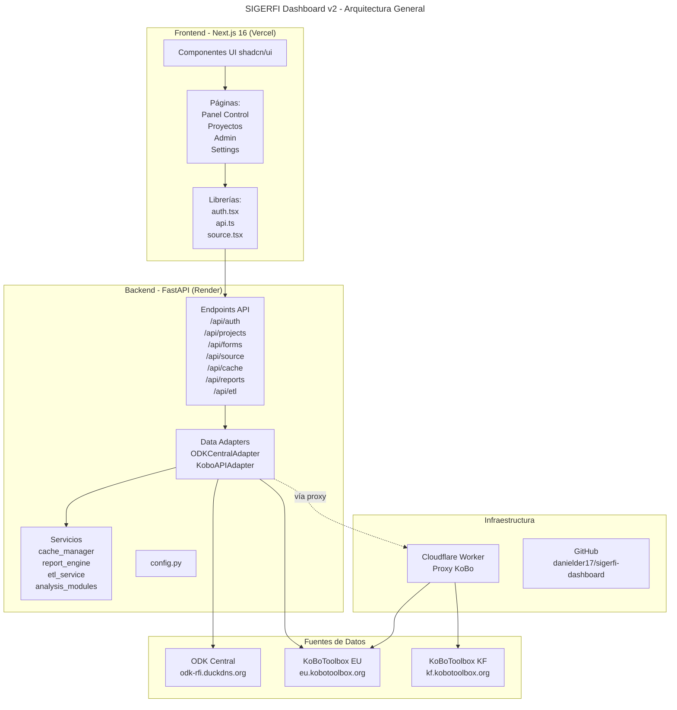
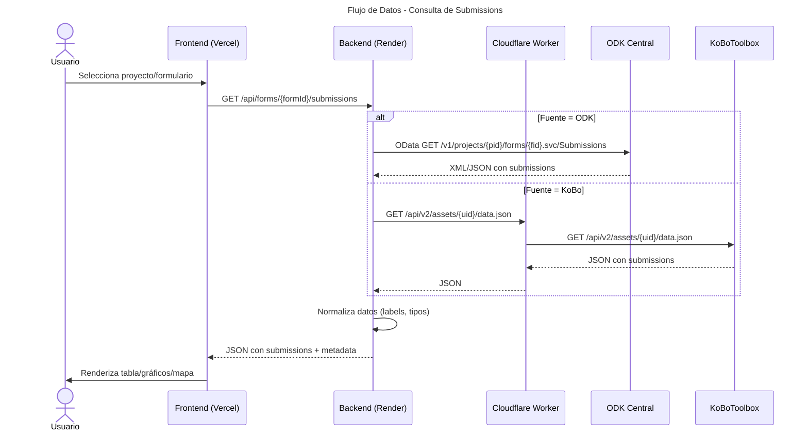
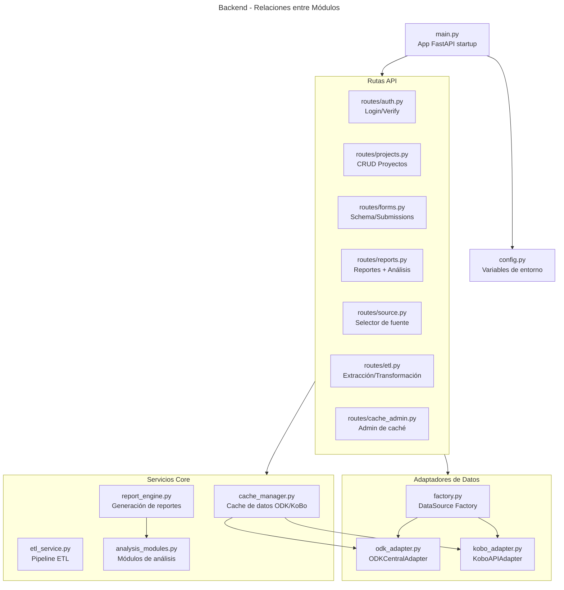
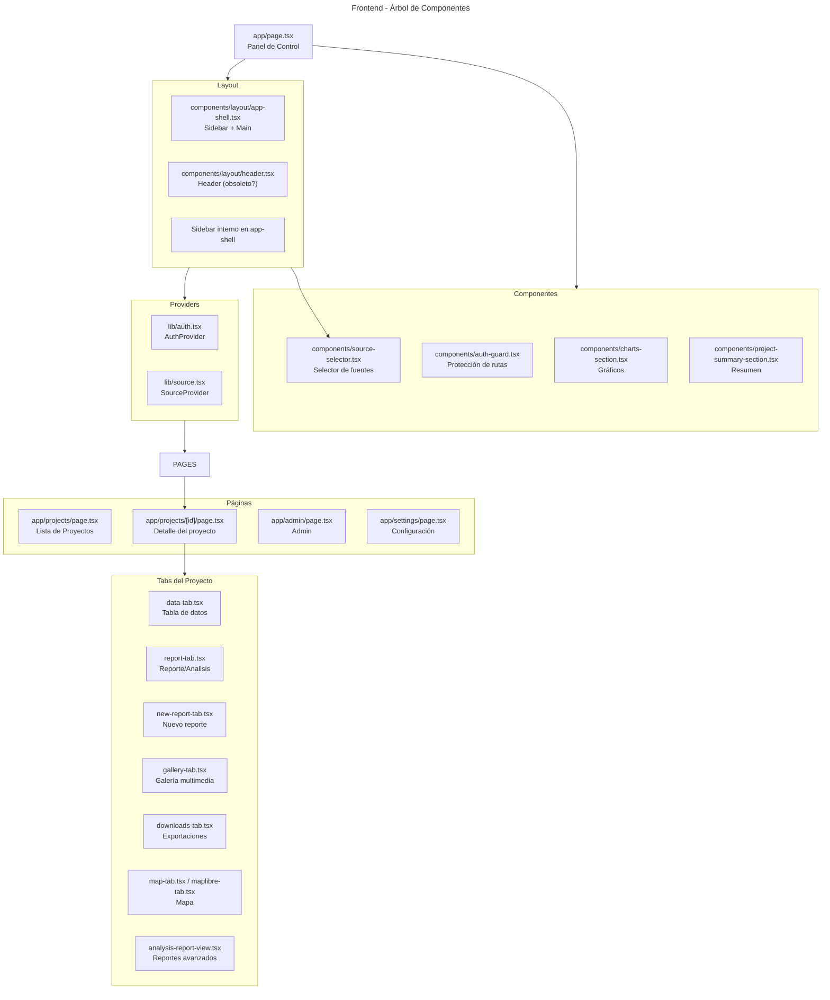
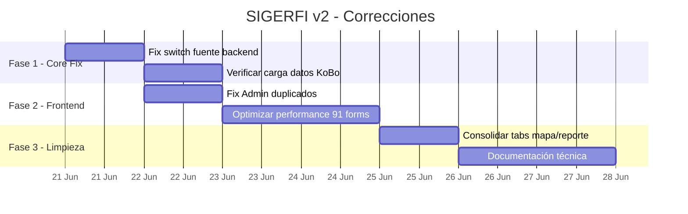

# Diagrama de Arquitectura - SIGERFI Data Analyst v2

## Visión General

## Diagrama de Flujo de Datos

## Mapa de Componentes Backend

## Mapa de Componentes Frontend

## Diagnosis de Problemas Detectados

| # | Problema | Causa Raíz | Severidad | Solución Propuesta |
|---|---|---|---|---|
| 1 | **KoBo no carga datos al switch** | `/api/source/activate` funciona pero los endpoints de datos siguen usando ODK | 🔴 Alta | `get_configured_adapter()` debe leer source persistido, no solo env vars |
| 2 | **KoBo KF aparece 2 veces en Admin** | El endpoint `/api/source/list` tiene rutas separadas por servidor, Admin quizás itera sobre fuentes | 🟡 Media | Revisar duplicidad en admin/page.tsx |
| 3 | **Sin recarga automática de datos** | Al cambiar fuente, el frontend no refresca proyectos/submissions | 🟡 Media | Ya tenemos reload, falta que el backend sirva datos correctos |
| 4 | **91 formularios KoBo EU - performance** | El frontend no está optimizado para miles de submissions | 🟡 Media | Paginación, virtual scrolling, caché agresiva |
| 5 | **Mapa duplicado (map-tab vs maplibre-tab)** | Dos implementaciones de mapa conviviendo | 🟢 Baja | Consolidar en maplibre-tab |
| 6 | **Reportes duplicados (report-tab vs new-report-tab)** | Evolución de código sin limpiar versión anterior | 🟢 Baja | Limpiar tabs obsoletos |

## Plan de Acción Recomendado

